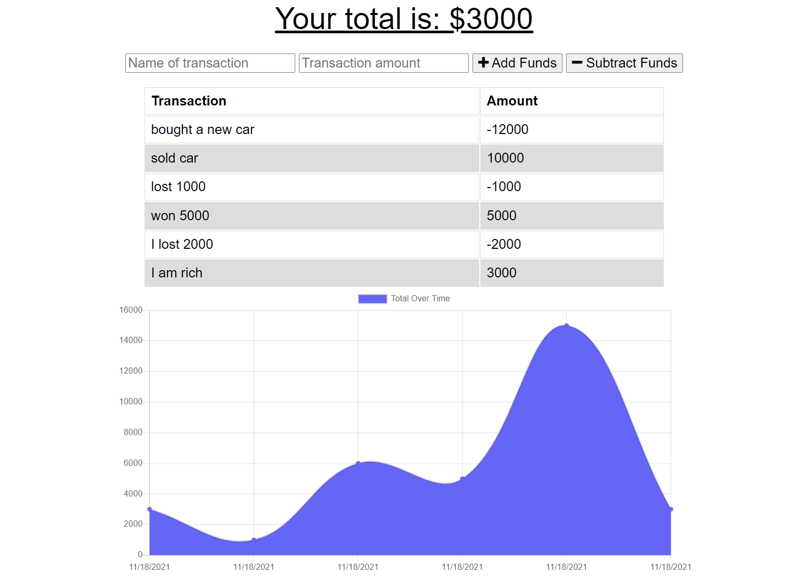

# Progressive Budget

## Description

List and check your budget with or without internet using this app. Add or substract and track your budget at any time.

## Site Picture

## Getting Started

These instructions will get you a copy of the project up and running on your local machine for development and testing purposes.

* Click on the green button named Code on github and copy the URL of the repository.
* Use the command git clone (repository's URL) to clone all existing project on your local machine.
* Start your testing opening your terminal or command line and going to the repository location on your machine.
* Type the command "npm install" to get the libraries used in this project.
* Type the command "npm start" to start the app.
* Open your browser and copy the url with your port of choice and start tracking your workouts!

## Prerequisites

* Git
* Node.js
* NPM
* Express
* MongoDB
* Mongoose

## Installing

* Fork the project to get your own copy of the repository.
* Clone the repository.
* Follow the steps above to run app.

## Built With

* [Javascript](https://developer.mozilla.org/en-US/docs/Web/javascript)
* [Node.js](https://nodejs.org/en/)
* [NPM](https://docs.npmjs.com/)
* [Express](https://expressjs.com/)
* [MongoDB](https://www.mongodb.com/)
* [Mongoose](https://mongoosejs.com/)
* [If-env](https://www.npmjs.com/package/if-env)
* [lite-server](https://www.npmjs.com/package/lite-server)
* [nodemon](https://www.npmjs.com/package/nodemon)

## Deployed Link

* [See Deployed App](https://andresliu-progressive-budget.herokuapp.com/)

## Authors

* **Andres Liu** 

## Contacts

- [Link to Portfolio Site](https://andresliu22.github.io/updated-portfolio/)
- [Link to Github](https://github.com/andresliu22/)
- [Link to LinkedIn](https://www.linkedin.com/in/andresliu22/)

## License

This project is licensed under the ISC License.

## Acknowledgments

* Always do some research to get the best possible way to code anything.
* Make the website and code easy to read for viewers and other developers by using brief comments.
* Be use to commit to get an insight of what you have done for each progress you make.

